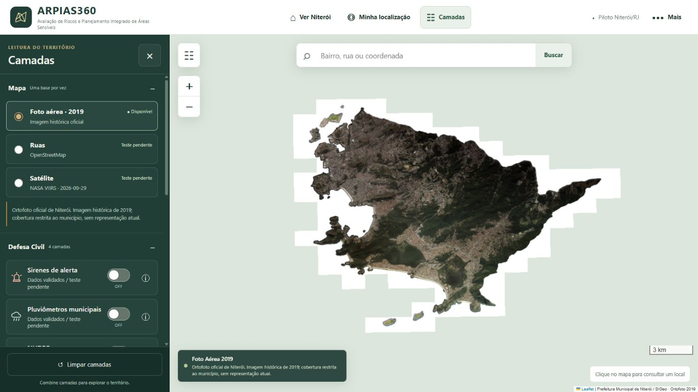
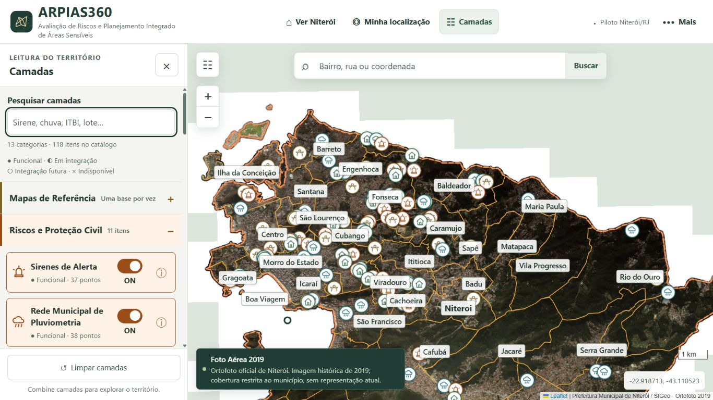
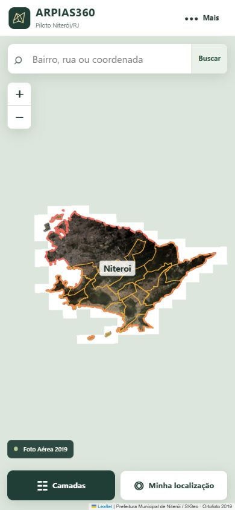
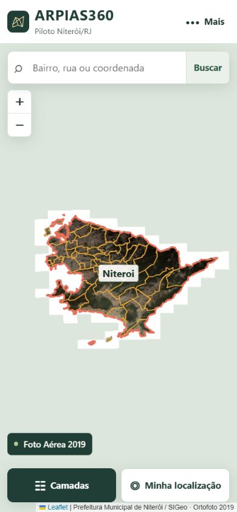
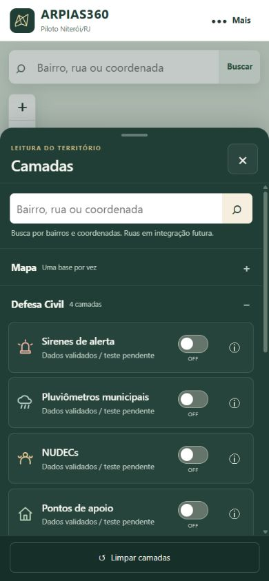
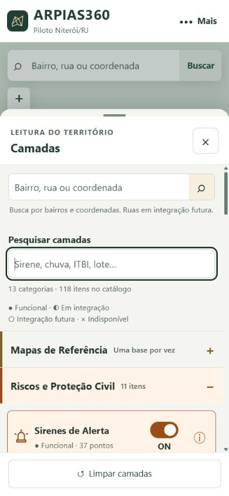
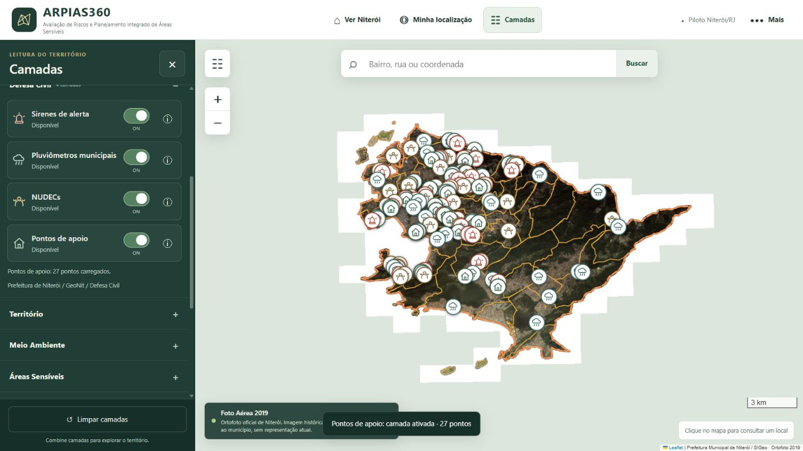
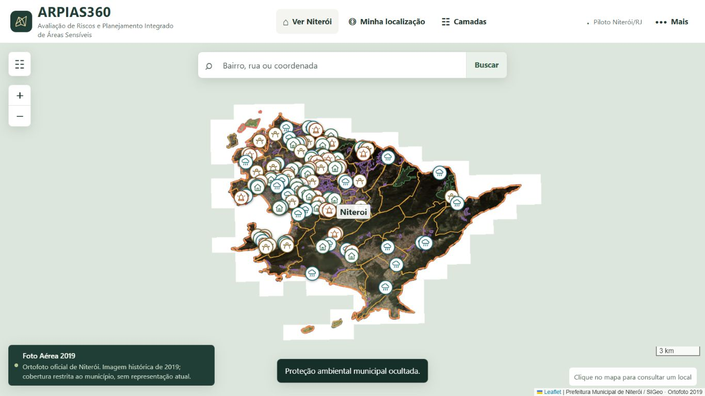

# Refinamento visual e catálogo — 01/10/2026

Branch: `codex/gecad-final`. Etapa concluída antes da implementação das ferramentas do prompt mestre.

## Escala final

| Uso | Tamanho |
| --- | --- |
| Texto geral e nomes de camada | 16px |
| Categorias | 17px, peso 750 |
| Título do painel | 20px |
| ARPIAS360 | 24px compacto; 26px desktop |
| Botões e campos dos popups | 15px |
| Bairros / município | 14px / 16px |
| Metadados / notas | 13px / 14px |

Superfícies claras, texto verde grafite, hierarchy por peso, tamanho e espaçamento. Switches alinhados, com ON/OFF de 14px. Popups com campos quebráveis, botões confortáveis e fechamento de 44px. Rótulos territoriais têm fundo branco e ocultação de colisões/duplicatas, respeitando controles e bordas do mapa.

## Paleta

| Categoria | Cor |
| --- | --- |
| Riscos e Proteção Civil / Gestão de Desastres | Laranja `#9b4d17` |
| Estrutura Territorial / Cadastro Territorial | Ocre `#806226` |
| Planejamento e Ordenamento Urbano | Roxo `#705484` |
| Meio Ambiente | Verde `#376e4d` |
| Clima e Monitoramento | Petróleo `#216d79` |
| Mercado Imobiliário | Violeta `#77508a` |
| Segurança Pública | Bordô `#893b50` |
| Indicadores Socioespaciais | Azul neutro `#4b6487` |
| Infraestrutura e Serviços | Cinza azulado `#536976` |
| Fragilidade Urbana | Terracota `#a14d63` |

Contraste calculado a partir das cores efetivas no navegador: mínimo 4,94:1 entre cores temáticas e fundos suaves; metadados 5,49:1 sobre superfície neutra. Critério de texto normal: [WCAG 2.2, contraste mínimo](https://www.w3.org/WAI/WCAG22/Understanding/contrast-minimum.html). A verificação destes pares não constitui certificação integral WCAG.

## Catálogo conectado

`data/catalogo.json` agora alimenta 13 categorias, 116 referências e mais dois controles experimentais preservados (118 entradas de interface). Pesquisa independente da busca territorial, com acentos e sinônimos. Estados combinam símbolo e texto. Futuras não recebem switch; referências em integração oferecem informações. As referências repetidas de hidrografia, pluviometria e satélite reutilizam o controle real, sem duplicar feições.

Obras de encosta, danos informados e unidades de segurança ficaram como integração futura: não há arquivo real ou endpoint específico comprovado para promovê-los. ITBI 2020–2025 aponta ao portal municipal já identificado; os arquivos anuais não foram comprovados individualmente e essa limitação aparece em cada entrada. Cemaden permanece separado dos 38 pluviômetros municipais.

Status funcional acompanha carregamento/error dos controles existentes. A mensagem de catálogo indisponível ficou restrita à falha real de leitura/validação. Nenhum grupo vazio no catálogo válido.

## Validação

- 26 testes automatizados aprovados, incluindo cinco novos testes de catálogo, sinônimos, fontes, controles reais e rejeição de catálogos inválidos.
- Painel aberto testado em 390×844, 768×1024, 1366×768 e 1920×1080. Sem overflow horizontal nos controles inspecionados; rolagem interna mantém textos e categorias acessíveis.
- Quatro camadas civis carregadas: 37 + 38 + 36 + 27 = 138 marcadores. Alias de pluviometria ocultou 38 pontos (100 restantes) e restaurou 138.
- Hidrografia, ZEIS, ZEIA, APP municipal e APA municipal tiveram carregamento confirmado na interface e foram visualizadas no mapa.
- Foto Aérea 2019 oficial, OSM e NASA VIIRS com data 2026-09-29 carregaram; overlays preservados nas trocas. Rótulos de 14/16px testados sobre as três bases. Na amostra de zoom 13: 27 rótulos visíveis, nenhuma colisão entre rótulos.
- Console sem erros/avisos na captura final. GeoJSON reais e manifesto de fontes preservados.

Métricas e buscas: [verificacao.json](refinamento-visual/verificacao.json).

## Comparações

| Vista | Antes | Depois |
| --- | --- | --- |
| Desktop |  |  |
| Mobile |  |  |
| Painel mobile |  |  |
| Categorias no mapa |  |  |

A referência anterior do mapa vem do checkpoint noturno; enquadramento e conjunto de overlays diferem da nova captura.

Capturas adicionais: [tablet](refinamento-visual/tablet-depois.png), [desktop amplo](refinamento-visual/amplo-depois.png), [busca chuva](refinamento-visual/busca-chuva.png), [busca mobile](refinamento-visual/busca-mobile.png), [consulta mobile](refinamento-visual/consulta-mobile.png), [consulta desktop](refinamento-visual/consulta-desktop.png), [rótulos nas ruas](refinamento-visual/rotulos-ruas.png), [rótulos no satélite](refinamento-visual/rotulos-satelite.png).
