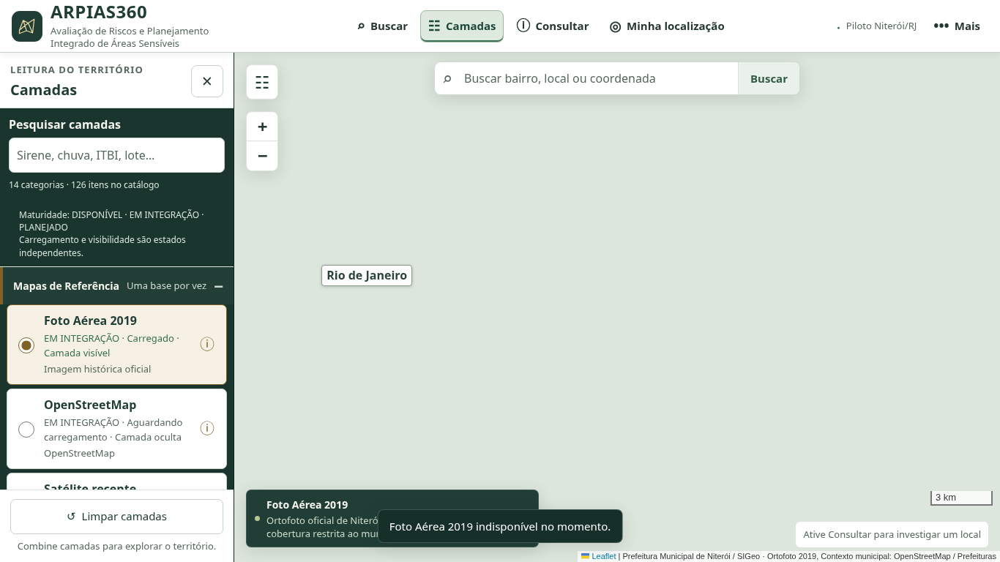
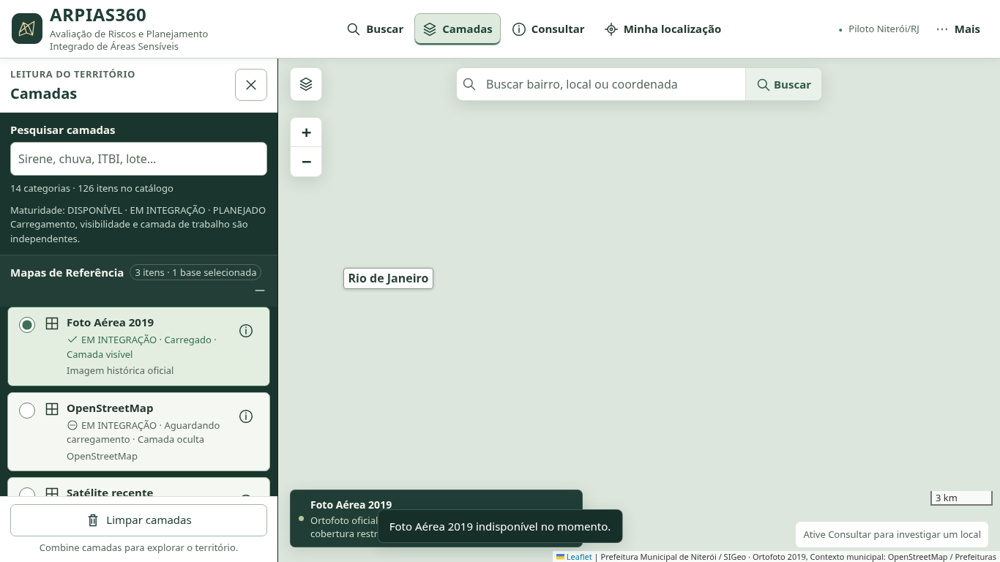
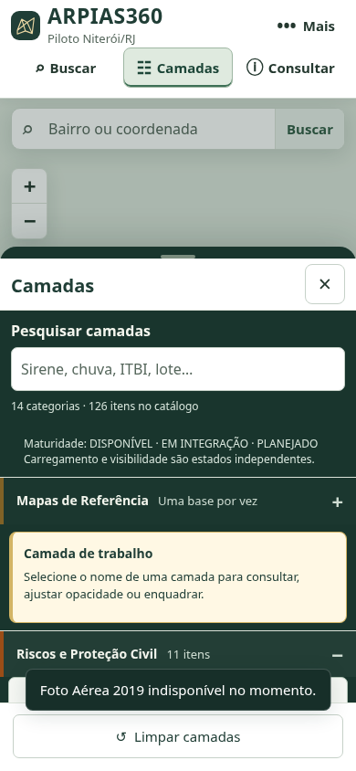
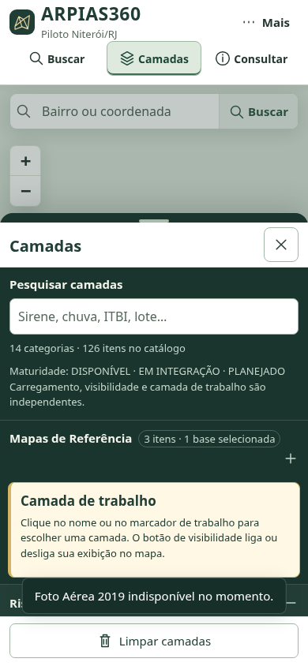
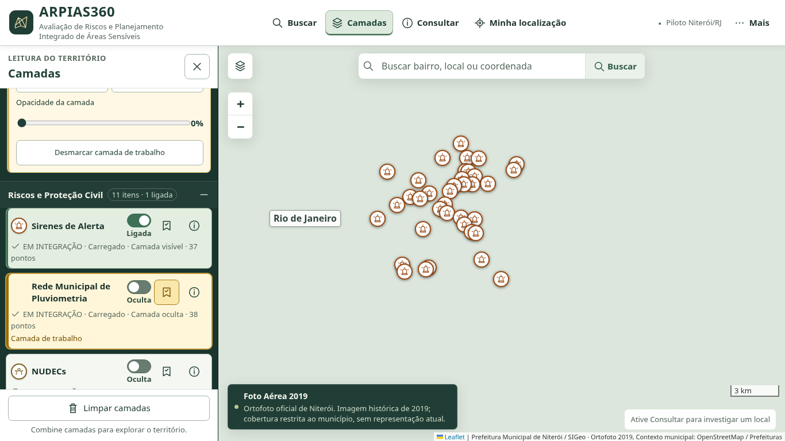
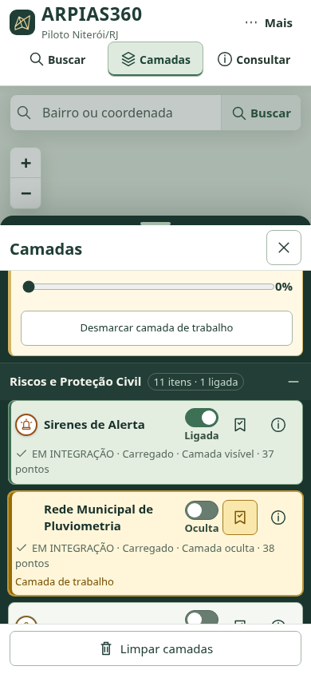

# FE-01A — evidências de implementação e regressão

Base remota verificada: `ed2854c6587c26b1765729b0714ca0458ed39632`.
Branch: `codex/frontend-fe01a`. A recuperação encontrou os cinco arquivos de frontend e dois testes novos preservados, sem descartar alterações. Na verificação inicial e antes da consolidação não havia PR aberto nem branch remota identificada como Jornada Territorial 001. As branches remotas eram `main`, `codex/arpias360-next` e `codex/gecad-final`; nenhuma implementação concorrente da Jornada foi encontrada.

## O que mudou

- Tipografia do sistema consolidada, títulos de painel de 20 px, nomes de camadas de 15 px e metadados de 13 px. Nomes extensos usam até duas linhas, com nome integral no título acessível e expansão no foco por teclado.
- SVGs próprios substituem caracteres e emojis nos controles do escopo. Controles mantêm IDs e nomes acessíveis; SVGs decorativos não duplicam sua leitura.
- Cada controle de camada integrado mostra a simbologia real: traços, preenchimentos e transparência de `ARPIASCartography`, marcador efetivamente usado na Defesa Civil e amostra das classes reais de relevo após carregar a classificação. Entradas planejadas não recebem cores/classes inventadas.
- As linhas distinguem símbolo, nome, visibilidade, escolha para trabalho e informações. A visibilidade usa “Ligada”/“Oculta”; a escolha tem botão próprio e indicação “Camada de trabalho”. Ações existentes permanecem no painel contextual já existente.
- Categorias mantêm expansão/recolhimento nativos, recebem SVGs e indicam controles ligados, incluindo aliases sem contagem duplicada. `data-control-id` apenas relaciona a linha ao controle original.
- Estados operacionais têm ícone e texto. A função `publicStatus()` e os valores técnicos de `data-state` não foram alterados: `loading`, `error`, `active` e `ready` continuam com seus consumidores. Maturidade, operação, visibilidade e escolha para trabalho continuam independentes.
- Estilos do painel foram consolidados; alvos de 44 px, foco visível e adaptação a telas estreitas/baixas preservam a área cartográfica.

## Validação

| Verificação | Resultado |
|---|---|
| Base anterior à implementação | 97 testes aprovados; 0 falhos; 0 ignorados |
| `npm ci --ignore-scripts` | Executado com cache gravável `/tmp/arpias-npm-cache`, mantendo integridade/TLS; 178 pacotes instalados |
| `npm test` final | 104 executados/aprovados; 0 falhos, cancelados, ignorados ou pendentes |
| Novos testes Node | 7: estilos/traçados, transparência inclusive zero, geometria dos símbolos, SVGs acessíveis, estados com texto, contagens/aliases e aliases de mapa-base |
| Navegador operacional | 14 grupos aprovados |
| Navegador Rodada 02 | 11 grupos aprovados |
| Navegador FE-01A | 4 grupos aprovados, com múltiplas verificações em cada grupo |
| Desktop e celular | 1366×768 e 390×844: controles, painel, categorias, busca, escolha por teclado, múltiplas camadas e ausência de rolagem horizontal |
| Regressão de resoluções | 1920×1080, 1366×768, 1024×768, 768×1024, 390×844 e 320×568 |
| Metadados | 351 medições em cada viewport principal; contraste mínimo observado 5,04:1 e tamanho mínimo 13 px |
| Zoom nativo de 200% | Chromium com zoom confirmado por preferência nativa e CDP: viewport CSS 683×340, DPR 2, janela 1366×768; captura completa da área renderizada 1366×681 |
| Sintaxe e diff | JavaScript/Python válidos; `git diff --check` aprovado |

Navegador local: Chromium 151.0.7922.173, via Playwright. As execuções finais foram registradas em 09/10/2026, aproximadamente 22:29–22:30, horário de Brasília; os JSON preservam os horários UTC originais.

Os fluxos verificam clique real para painel/categorias/zoom, teclado/foco, seleção para trabalho sem ligar a camada, múltiplas camadas simultâneas, aliases, opacidade zero, carregamento/falha e informações/simbologia das quatro classificações do relevo. As regressões anteriores cobrem seleção, consultas, geolocalização simulada, medição, preferências, arraste de painéis e relatórios com ponto, linha, polígono e geometria multipartida, inclusive com a origem oculta. O novo teste de apresentação é chamado pelo script operacional já utilizado no workflow existente.

Os JSON locais registram o SHA vigente e `dirty: true`, porque os testes antecederam seus commits. O `manifest.json` registra os hashes dos arquivos efetivamente testados. O SHA final e os checks de CI ficam registrados no PR. Após a primeira execução do CI, o cenário de zoom nativo passou a selecionar explicitamente o Chromium completo (`channel="chromium"`), em vez do `headless-shell` padrão do Playwright. Os quatro grupos FE-01A foram executados novamente e aprovados; nenhuma expectativa foi relaxada e o frontend permaneceu intacto. Falhas desse teste também são registradas nas anotações do check, pois o download dos logs do GitHub retornou HTTP 403 neste ambiente.

## Comparação visual — mesmo estado inicial

| Desktop antes | Desktop depois |
|---|---|
|  |  |

| Celular antes | Celular depois |
|---|---|
|  |  |

Painel fechado: [desktop antes](before-desktop-closed.png), [desktop depois](after-desktop-initial-closed.png), [celular antes](before-mobile-closed.png) e [celular depois](after-mobile-initial-closed.png).

## Controles, trabalho e símbolos

| Desktop | Celular |
|---|---|
|  |  |

As sirenes estão ligadas enquanto os pluviômetros estão escolhidos para trabalho e ocultos, com opacidade zero. O símbolo segue a mesma transparência usada no mapa; por isso o marcador dos pluviômetros fica invisível, sem mudar sua escolha para trabalho. Os pontos de sirenes renderizados provêm da coleção local existente.

[Relevo e classificação](after-relief-classification.png) · [Entradas planejadas](after-planned-states.png) · [Zoom nativo de 200%](after-native-browser-zoom-200.png).

## Preservação e limites

`showTerritorial`, lógica de consulta espacial, medição, desenho, edição, relatórios, geometria, preferências, política do catálogo, fontes/dados científicos, dependências e bundles permanecem preservados. `js/tools.js` somente atualiza SVGs de recolhimento/expansão e disponibiliza o renderizador de amostras existente, cuja opacidade agora respeita também o estilo original.

Os testes são locais e controlados: as dependências CDN são obtidas com TLS normal e as chamadas GIS externas recebem falha 503 deliberada. As bases externas vazias nas imagens refletem esse cenário. Eventos operacionais e geometrias sintéticas dos testes de relatório não são evidência de serviço GIS real. Não houve homologação pública, validação de celular físico/GPS físico ou declaração de conformidade WCAG.

Nenhuma regressão foi detectada nos fluxos executados. Não foram implementados Jornada 001, perfis, novos indicadores, gráficos, backend, tema escuro ou outro sistema de janelas. Nenhuma biblioteca ou fonte externa foi adicionada. A entrega é um PR para revisão; `main`, Pages e produção não são alterados por este incremento.
