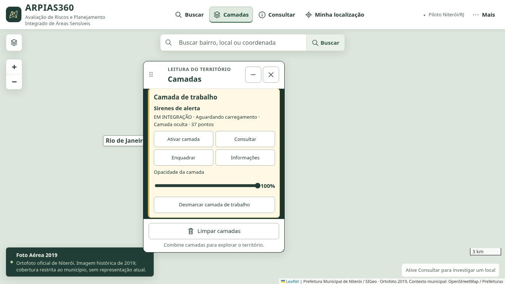
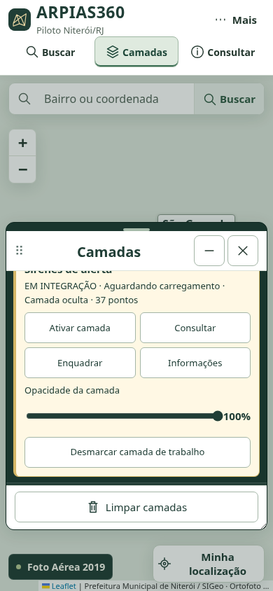
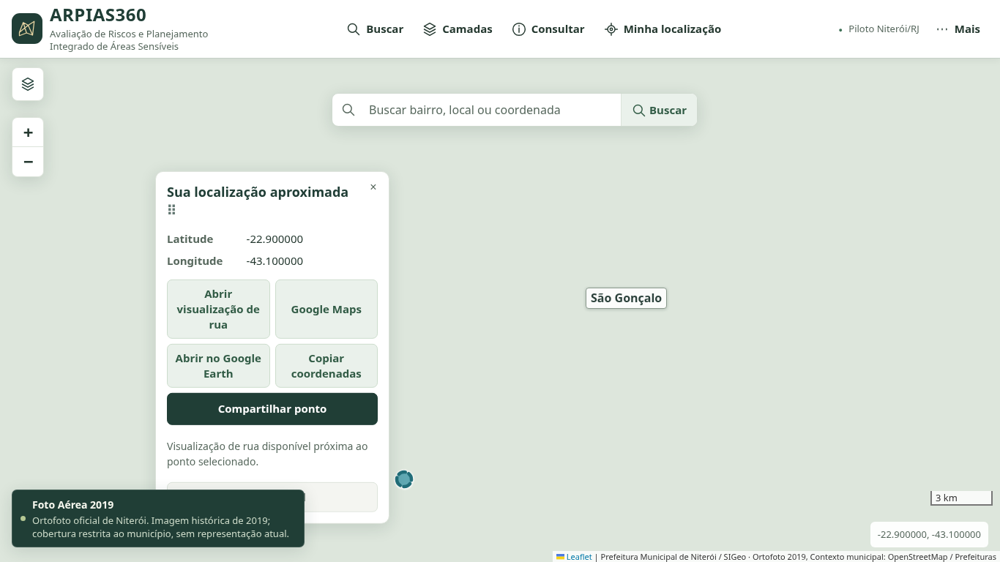
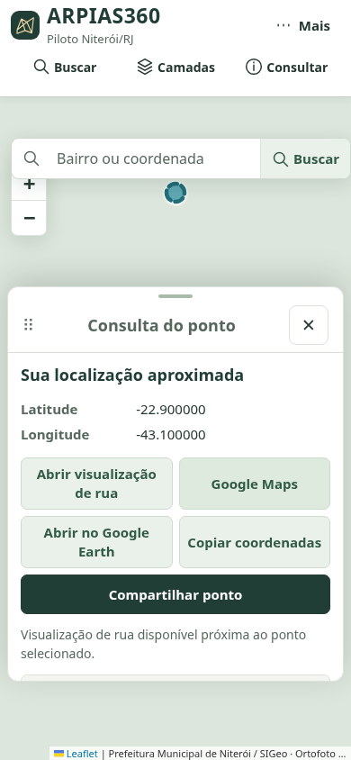

# Painéis móveis

Base: `a02dabd2e89ae9b77e0c9e4d5275066cb204102a` (merge aprovado do FE-01A). A correção foi feita em branch separada, preservando `main` e a configuração do Pages.

## Uso e mudanças

- Arraste pelo cabeçalho marcado com ⠿. No teclado, foque o cabeçalho e use as setas (10 px; Shift + seta: 40 px). O toque usa o mesmo comportamento, sem desativar a rolagem do conteúdo.
- Camadas passa a ser uma janela menor: largura inicial desktop 350 px, altura até 580 px. Não reserva mais uma faixa inteira do mapa. Use **−** para recolher, **+** para expandir e o canto inferior direito para redimensionar em desktop.
- São móveis: Camadas, Ferramenta, Sobre, Ficha territorial, Consulta do ponto, Informações (incluindo Legenda, Ajuda e Metodologia), Relatório técnico, Compartilhamento/QR, Formulário de trabalho, Confirmação, barra de busca (pelo ícone) e resultados da busca (pelo título).
- Janelas ficam limitadas à área disponível e são ajustadas após redimensionamento. Os botões, campos, foco e semântica modal dos diálogos permanecem funcionais.
- Posições de Camadas, Ficha, Consulta, Ferramenta e Sobre entram nas preferências validadas existentes. Diálogos, busca e balões mantêm posição durante sua sessão; coordenadas e geometrias não são modificadas pelo arraste.
- A consulta móvel da localização agora resolve o conteúdo do callback do Leaflet antes de exibir a ficha. Antes ela podia mostrar o código da função em vez do título e das coordenadas.

## Verificação

- `npm test`: **107 executados, 107 aprovados, zero falhas/ignorados/cancelados/pendentes**; três testes novos de limites e validação de posições.
- Navegador: **31 grupos aprovados** (14 operacionais, 11 Rodada 02, 4 FE-01A e 2 de mobilidade com várias verificações).
- Novas verificações usam mouse e toque CDP reais, teclado, redimensionamento nativo, recolhimento/expansão, reload e posições salvas, cinco diálogos nativos, outros painéis e balão/consulta. Conferem independência de visibilidade/trabalho e manutenção das coordenadas. Desktop 1366×768 e celular 390×844; regressões anteriores cobrem seis resoluções e zoom nativo 200%.
- JavaScript/Python com sintaxe válida; `git diff --check` aprovado. Dados, geometria, estilos cartográficos, métodos científicos, relatórios e dependências não foram alterados.
- Os novos testes são chamados pelo script operacional já utilizado no CI existente.

Testes locais controlados, sem validação de serviços GIS reais ou do site publicado. CDN com TLS normal; demais serviços externos recebem 503 deliberado. O ponto de localização dos testes é sintético. As imagens mostram comportamento do frontend local, não GPS físico ou publicação. JSON registra o SHA-base e árvore modificada antes do commit; o manifesto contém os hashes correspondentes.

## Capturas

| Camadas deslocada e redimensionada no desktop | Camadas deslocada no celular |
|---|---|
|  |  |

| Balão deslocado, coordenadas preservadas | Consulta deslocada por toque, ficha legível |
|---|---|
|  |  |
